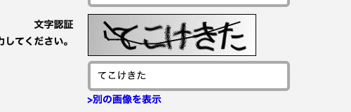
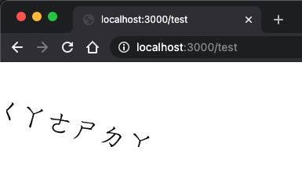

# zhuyin-captcha

Captcha generator with [Zhuyin](https://en.wikipedia.org/wiki/Bopomofo) (Bopomofo) characters.

Inspired by Hiragana captcha in Japanese website.


## Run the generator server

```shell
$ node server
```

Then you can get a generator by `localhost:3000/test`.

## Demo


## Reference
https://healeycodes.com/javascript/webdev/node/tutorial/2019/11/11/lets-generate-captchas.html
